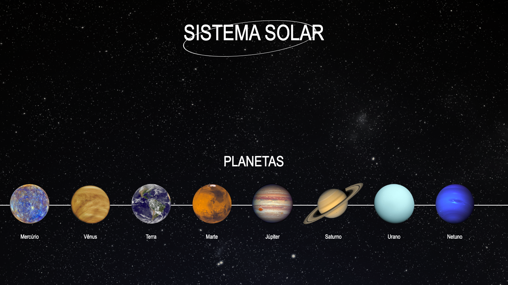
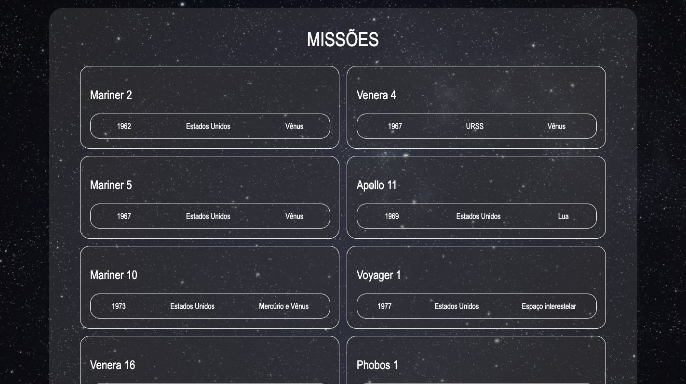

# Solar System

Solar System project It's a model of the solar system! By using this application, a user is able to:

- View all solar system planets rendered on canvas;
- Visualizar todas as cartas com informações sobre missões espaciais;

<div align="center" display="inline">


</div>

## How to use:
- First clone the repository into your machine;

```
 git clone git@github.com:GabiNamu/trybewallet.git
```
- After cloning, enter into the repository and install the dependencies;

```
npm install
```
- Then to see in your browser, you just need to do a npm start;
```
npm start
```
## Main technologies used:
- React;
- JavaScript;
- Css;
